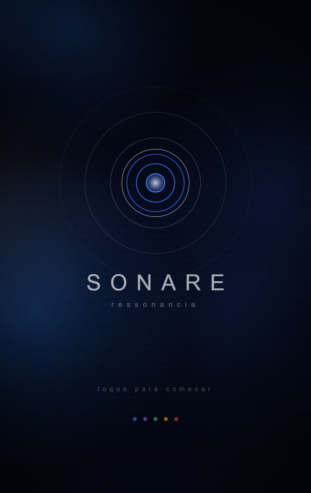
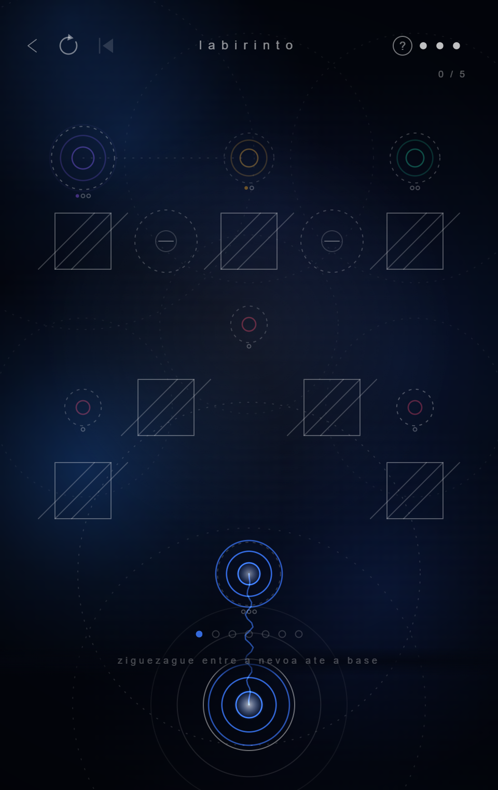

# SONARE

Um quebra-cabeça sobre construir redes de ressonância: arraste sinos, conecte-os pelo alcance do som que emitem, e leve o sinal até o Sino Mestre.

Feito inteiramente em **HTML5 Canvas + JavaScript puro** — um único arquivo, zero dependências, zero build step.

<p align="center">
  
  
</p>

## ▶ Jogar agora

**[SEU-USUARIO.github.io/SONARE](https://SEU-USUARIO.github.io/SONARE/)** — direto no navegador, sem instalar nada.

*(troque `SEU-USUARIO` pelo seu usuário do GitHub depois de publicar o repositório)*

## O que é

Cada sino tem um alcance: se outro sino estiver dentro desse alcance — e não houver um muro no caminho — os dois se conectam, e o som se propaga de sino em sino até chegar ao Sino Mestre. O objetivo de cada fase é arrastar os sinos até que **todos** estejam conectados a essa rede, gastando o menor número de movimentos possível.

- **Tamanho define alcance e capacidade.** Sinos graves alcançam mais longe e sustentam mais conexões; sinos agudos alcançam pouco, mas cabem em espaços apertados.
- **O terreno interfere no som.** Névoa (nevoa) encolhe o alcance; ressonância (amps) o amplia; muros bloqueiam a linha de conexão por completo.
- **O Sino Mestre é uma raiz de verdade** — só aceita um número limitado de sinos ligados diretamente a ele, então também é preciso decidir *quem* fica mais perto.
- **19 fases em 2 capítulos** (*Ponta* e *Elo*), cada uma introduzindo uma mecânica nova, mais um **modo desafio** com fases geradas proceduralmente e um sistema de vidas.

## Destaques técnicos

Alguns problemas específicos que valeram a pena resolver neste projeto:

- **Toda a interface é desenhada à mão** com primitivas de `canvas` — nenhum elemento de DOM, nenhuma biblioteca de UI.
- **Validação de fases por força bruta.** Cada fase tem sua contagem mínima de movimentos provada por um solver próprio (`solver.js`), garantindo que o par de estrelas de cada fase seja sempre alcançável.
- **Cabo de conexão como onda sonora real.** A animação do vínculo entre sinos é uma senoide cujo comprimento de onda vem da frequência musical real de cada sino (`grave1` = 130.81 Hz / C3 … `aguda` = 329.63 Hz / E4) — não é decoração, é o dado do próprio sino.
- **Grade fina de posicionamento.** Sinos se movem numa subdivisão de 5× a grade de obstáculos do mapa, com colisão por distância real (raio a raio) em vez de célula exata — o suficiente pra parecer posicionamento livre sem perder o sistema de contagem de movimentos que sustenta as estrelas.
- **Um arquivo, dois builds.** `Sonare.html` é a versão de produção (progressão sequencial, economia real); o projeto também mantém internamente uma build de teste com tudo desbloqueado, usada durante o desenvolvimento pra validar fases rapidamente.

## Rodando localmente

Não precisa de servidor, build ou instalação — é um único arquivo HTML autocontido.

```bash
git clone https://github.com/SEU-USUARIO/SONARE.git
cd SONARE
```

Depois é só abrir `Sonare.html` (ou `index.html`) direto no navegador.

## Estrutura

```
SONARE/
├─ index.html                 → redireciona para Sonare.html (usado pelo GitHub Pages)
├─ Sonare.html                → o jogo
├─ solver.js                  → validador de fases por força bruta (Node)
└─ docs/
   ├─ screenshot-*.png
   └─ processo-de-design/     → GDD e explorações visuais (skins, mapa, título, undo…)
```

A pasta `docs/processo-de-design` guarda o material de processo: o documento de design (GDD) e as galerias comparativas usadas para decidir skins de sino, layout do mapa, tipografia do título e outros detalhes — caso você queira ver como as decisões visuais foram tomadas, não só o resultado final.

## Licença

MIT — veja [LICENSE](LICENSE).
